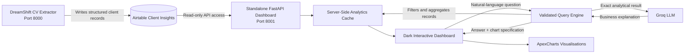
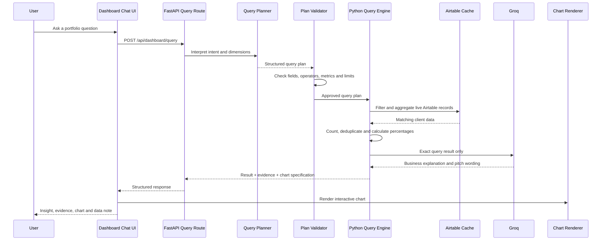

# DreamShift Client Intelligence Dashboard


A standalone, live client-intelligence and business-analytics application that transforms DreamShift’s Airtable records into interactive portfolio insights, marketing evidence, partnership opportunities, and pitch-deck-ready narratives.

This project is intentionally separated from the CV extraction application. The extractor writes structured client intelligence to Airtable, while this dashboard reads and analyses that data through an independent FastAPI application.

The platform combines:

* live Airtable analytics,
* interactive filtering,
* dynamic Top-N rankings,
* Australian geographic analysis,
* university and qualification insights,
* industry and job-role intelligence,
* certification and provider analysis,
* an LLM-assisted Airtable query agent,
* deterministic Python calculations,
* interactive charts inside chatbot responses,
* and a modern dark glassmorphism user interface.

Built and engineered by **Navodhya Fernando**.

---

## What This Project Does

The DreamShift Client Intelligence Dashboard helps the business understand the people it has supported across Australia.

It turns structured client records into answers such as:

* Which Australian states contain the largest client segments?
* Which industries and job families does DreamShift support most?
* Which target roles appear most frequently?
* Which universities and education institutions are represented?
* Which visa categories and experience levels are common?
* Which professional certifications and certificate providers appear most?
* Which client segments could support a marketing campaign?
* Which statistics can be used in business and partnership pitch decks?
* How complete and reliable is the available Airtable data?

The dashboard is designed for:

* marketing planning,
* campaign segmentation,
* business-development proposals,
* university and training-provider partnerships,
* pitch-deck preparation,
* service-capacity planning,
* portfolio analysis,
* and internal strategic decision-making.

These records represent **DreamShift clients**, not job candidates.

---

## Features

* **Live Airtable Connection:** Reads current client-intelligence records through a server-side Airtable Personal Access Token.
* **Independent Application:** Runs separately from the DreamShift CV extractor with its own project directory, virtual environment, `.env`, Uvicorn process, and port.
* **Interactive Executive Dashboard:** Presents client reach, industries, roles, states, qualifications, experience and certifications through dynamic charts.
* **Australian Geographic View:** Shows client distribution across Australian states and allows state-level filtering.
* **Dynamic Top-N Analysis:** Automatically ranks industries, roles, institutions, cities, skills, tools, certifications and certificate providers.
* **Education Footprint:** Combines PhD, master’s, bachelor’s and other institution fields into a unified education-institution dimension.
* **Client-Safe Analytics Payload:** Excludes names, employers, CV text, contact details and source URLs from browser-facing analytics.
* **Query-Agent Chatbot:** Converts natural-language questions into validated analytical query plans.
* **Deterministic Calculations:** Uses Python—not the LLM—to filter records, count clients, calculate percentages, compare segments and create cross-tabs.
* **AI-Grounded Explanations:** Uses Groq to turn exact query results into clear business insights and pitch-deck-ready language.
* **Interactive Chat Charts:** Returns bar charts, donut charts, grouped comparisons and heatmaps inside chatbot responses.
* **Certification Normalisation:** Consolidates common aliases and separates professional certifications from general compliance cards.
* **Data-Coverage Reporting:** Shows field availability and completeness across Airtable schema groups.
* **Live Refresh and Caching:** Supports automatic browser refresh, server-side caching and manual cache bypass.
* **Dark Glassmorphism UI:** Uses DreamShift’s brand palette, Poppins typography, high-contrast text and responsive layouts.
* **Responsive Design:** Supports desktop, tablet and mobile dashboard use.

---

## Benefits

* Converts operational Airtable records into executive business intelligence.
* Produces credible, evidence-based statistics for pitch decks.
* Helps DreamShift understand which industries and roles dominate its client portfolio.
* Identifies geographic concentration across Australian states and cities.
* Reveals potential university, certification-provider and training partnerships.
* Makes campaign segmentation faster and more data-driven.
* Reduces manual Airtable filtering and spreadsheet analysis.
* Prevents generic chatbot answers by querying the exact required fields.
* Keeps sensitive client identifiers away from the browser and LLM prompt.
* Demonstrates practical AI engineering, analytics engineering, backend development and UI/UX design in one system.

---

## System Architecture



The extractor and dashboard are operationally independent.

```text
DreamShift CV Extractor
        │
        │ writes structured records
        ▼
     Airtable
        ▲
        │ reads records only
        │
Client Intelligence Dashboard
```

The extractor can be restarted or upgraded without taking down the dashboard. The dashboard can also be redesigned without risking CV-extraction jobs.

---

## Tech Stack

### Backend

* Python 3.11+
* FastAPI
* Uvicorn
* Pydantic
* HTTPX
* python-dotenv

### Data Source

* Airtable Web API
* Airtable Personal Access Token
* Airtable schema metadata endpoint
* Paginated record retrieval
* Read-only analytics access

### AI Layer

* Groq OpenAI-compatible API
* Configurable Groq chat model
* Up to eight authorised API keys
* Structured JSON query planning
* Structured JSON response generation
* Deterministic fallback answers

### Query and Analytics Layer

* validated query plans,
* approved analytical dimensions,
* approved filter operators,
* multi-value field expansion,
* per-client deduplication,
* ranking,
* counts,
* percentages,
* averages,
* comparisons,
* cross-tab analysis,
* heatmap preparation,
* field coverage analysis,
* and deterministic pitch statistics.

### Frontend

* HTML
* CSS
* Vanilla JavaScript
* Poppins typography
* ApexCharts
* responsive layouts
* glassmorphism effects
* interactive filters
* chat drawer
* dynamic chart rendering

### Brand Palette

```text
#24101A — primary dark background
#411C30 — plum surface and secondary background
#F6B900 — primary gold accent
#FFE500 — high-energy yellow highlight
#FFFFFF — high-contrast text
```

---

## Why This Project Is Significant

This project combines **software engineering**, **AI engineering**, **analytics engineering**, **business intelligence**, and **UI/UX design**.

### Software Engineering

* Built a standalone FastAPI application with a clear separation of concerns.
* Created server-side Airtable data retrieval and pagination.
* Added application-level caching and configurable refresh intervals.
* Designed independent environment configuration and deployment.
* Implemented safe API routes for dashboard data and analytical queries.
* Created responsive frontend views using modular JavaScript.
* Added backup-aware patching and incremental application upgrades.
* Separated the dashboard from the CV extraction production workflow.

### AI Engineering

* Created a natural-language-to-query planning layer.
* Restricted the LLM to an approved Airtable analytics schema.
* Added query-plan validation before execution.
* Used Python for exact calculations instead of relying on model arithmetic.
* Used the LLM only for intent interpretation and business-language generation.
* Added deterministic fallback responses when Groq is unavailable.
* Prevented sensitive direct identifiers from entering model prompts.
* Returned structured chart specifications with analytical answers.

### Data Science and Analytics

* Built descriptive analytics for client portfolio composition.
* Added diagnostic analysis across state, industry, role, education and certification dimensions.
* Added cross-segment comparisons and heatmaps.
* Created percentage calculations using the correct filtered denominator.
* Deduplicated multi-select values at the client level.
* Normalised common certification aliases.
* Separated professional credentials from general compliance credentials.
* Added data-completeness and schema-coverage reporting.
* Prepared the system for future trend analysis and predictive marketing insights.

### UI and UX Design

* Designed a dark, high-contrast interface using DreamShift’s brand identity.
* Applied glassmorphism without reducing text readability.
* Used Poppins with deliberate font weight and hierarchy.
* Added dynamic filters within the main dashboard experience.
* Designed interactive charts instead of static summary cards.
* Added visual analytical responses inside the chatbot.
* Created responsive desktop, tablet and mobile experiences.

---

## Airtable Query-Agent Flow



The core principle is:

```text
LLM for understanding and writing
Python for filtering and calculation
Airtable for source data
ApexCharts for visualisation
```

---

## Supported Query Dimensions

The query agent can analyse approved fields such as:

| Query Dimension | Airtable / Derived Field |
| --- | --- |
| State | `Current State` |
| City | `Current City` |
| Primary industry | `Primary Industry` |
| Secondary industries | `Secondary Industries` |
| Primary target role | `Primary Target Role` |
| Role family | `Role Family` |
| Job function | `Job Function` |
| Current job title | `Current Job Title` |
| Most recent job title | `Most Recent Job Title` |
| Visa category | `Visa Category` |
| Seniority | `Seniority Level` |
| Highest qualification | `Highest Qualification Level` |
| Education institution | Combined derived institution field |
| Education country | Combined derived education-country field |
| Certification | `Certificate Names` |
| Certificate provider | `Certificate Institutions` |
| Tools and platforms | `Tools and Platforms` |
| Skills | Combined core and technical skills |
| Total experience | `Total Years of Experience` |
| Australian experience | `Australian Experience Years` |
| Business domain | `Business Domains` |
| Regulated industry | `Regulated Industries` |
| Work rights | `Full Work Rights` |
| Leadership | `Leadership Experience` |
| Career change | `Career Change Detected` |
| Extraction status | `Extraction Status` |

Direct identifiers are not queryable through the chatbot.

---

## Supported Query Types

### Ranking

```text
What are the most popular certificate institutions?
Which universities are represented most?
What are the top target roles in Victoria?
```

### Count

```text
How many clients target Business Analyst roles?
How many IT clients are based in New South Wales?
```

### Percentage

```text
What percentage of IT clients have AWS certifications?
What percentage of clients have Australian qualifications?
```

### Comparison

```text
Compare Software Engineering and Business Analysis clients.
Compare Victoria and New South Wales by industry.
```

### Cross-Tab Analysis

```text
Which universities produce the most Business Analyst clients?
Show state by industry concentration.
```

### Average

```text
What is the average experience of engineering clients?
How much Australian experience do Business Analyst clients have?
```

### Summary

```text
Create a pitch-deck summary of our Australian reach.
Which segment should our next campaign target?
```

---

## Multi-Value Field Handling

Several Airtable fields may contain multiple values:

* `Certificate Names`
* `Certificate Institutions`
* `Master’s Institutions`
* `Bachelor’s Institutions`
* `Other Institutions`
* `Secondary Industries`
* `Tools and Platforms`
* `Core Professional Skills`
* `Technical Skills`

The engine expands these values for grouping while deduplicating within each client record.

Example input:

```json
[
  "Coursera",
  "Coursera",
  "Microsoft"
]
```

Correct analytical count:

```text
Coursera: 1 client
Microsoft: 1 client
```

A client is never counted twice for the same normalised value.

---

## Certification Intelligence

The application normalises common aliases such as:

```text
AWS Cloud Practitioner
AWS Certified Cloud Practitioner
Cloud Practitioner
```

into:

```text
AWS Certified Cloud Practitioner
```

It also distinguishes professional credentials from general compliance items.

### Professional Credentials

Examples:

* AWS Certified Cloud Practitioner
* Microsoft PL-300 Power BI Data Analyst
* Cisco CCNA
* Google Data Analytics Professional Certificate
* ISTQB Certified Tester
* Certified ScrumMaster
* Microsoft Azure Fundamentals

### General Compliance Credentials

Examples:

* White Card
* Working with Children Check
* First Aid
* Police Check
* Responsible Service of Alcohol
* Driver’s Licence
* Forklift Licence
* NDIS Worker Screening

This prevents a White Card or similar compliance credential from being presented as an IT certification.

---

## Dashboard Sections

### Overview

* total clients,
* industries represented,
* target roles,
* states represented,
* institutions represented,
* Australian qualification share,
* Australian state map,
* top industries,
* top roles,
* and experience profile.

### Client Market

* state distribution,
* city distribution,
* visa categories,
* seniority levels,
* Australian experience,
* state-by-industry heatmap,
* work rights,
* leadership exposure,
* and career-change indicators.

### Education

* top institutions,
* highest qualification distribution,
* education countries,
* Australian qualification share,
* postgraduate share,
* and education-footprint insights.

### Roles and Skills

* role families,
* target roles,
* top skills,
* top tools and platforms,
* certifications,
* certificate providers,
* and role-aligned credential analysis.

### Data Quality

* extraction status,
* expected Airtable fields,
* populated field counts,
* coverage percentage,
* additional fields,
* and schema-readiness indicators.

---

## Interactive Charts

The dashboard uses ApexCharts to render:

* horizontal bar charts,
* vertical bar charts,
* donut charts,
* radial charts,
* area charts,
* treemaps,
* heatmaps,
* grouped comparisons,
* radar charts,
* and chatbot-generated result charts.

Charts respond to the active dashboard filters.

A chart can also be returned directly inside the chatbot response:

```json
{
  "type": "horizontal_bar",
  "title": "Most Popular Certificate Institutions",
  "categories": [
    "Coursera",
    "Microsoft",
    "AWS"
  ],
  "series": [
    {
      "name": "Clients",
      "data": [18, 13, 9]
    }
  ]
}
```

---

## API Routes

### Root Redirect

```http
GET /
```

Redirects to:

```text
/dashboard
```

### Health Check

```http
GET /health
```

Example response:

```json
{
  "status": "ok",
  "app": "dreamshift-client-intelligence"
}
```

### Dashboard Page

```http
GET /dashboard
```

Returns the main interactive dashboard.

### Dashboard Data

```http
GET /api/dashboard/data
```

Optional cache bypass:

```http
GET /api/dashboard/data?force=true
```

Returns:

* browser-safe client analytics records,
* record count,
* refresh interval,
* fetch timestamp,
* Airtable schema information,
* and privacy exclusions.

### Query Preview

```http
POST /api/dashboard/query/preview
```

Example body:

```json
{
  "question": "Most popular certificate institutions",
  "filters": {}
}
```

Example response:

```json
{
  "query_plan": {
    "intent": "rank",
    "dimension": "certificate_institution",
    "metric": "client_count",
    "limit": 10,
    "chart": "horizontal_bar"
  }
}
```

### Execute Query

```http
POST /api/dashboard/query
```

Example body:

```json
{
  "question": "Which certifications are common among IT clients in Victoria?",
  "filters": {
    "state": "VIC",
    "industry": "Information Technology"
  }
}
```

Returns:

* validated query plan,
* filtered client count,
* exact analytical result,
* field coverage,
* direct answer,
* evidence-led findings,
* pitch-deck line,
* business implication,
* data limitation,
* model information,
* and chart specification.

### Legacy Ask Route

```http
POST /api/dashboard/ask
```

The newer query-agent route should be preferred for field-specific analysis.

---

## Repository Structure

```text
dreamshift_client_intelligence_dashboard/
  app/
    __init__.py
    config.py                 # Environment and Airtable configuration
    dashboard.py              # Airtable client, cache, routes and analytics
    query_engine.py           # Query planning, validation and execution
    main.py                   # FastAPI application entry point

    templates/
      dashboard.html          # Main dashboard and chatbot layout

    static/
      app.js                  # Filters, charts, query chat and interactions
      styles.css              # Dark glassmorphism design system
      dreamshift-logo.png     # DreamShift brand asset

  tests/
    test_smoke.py             # Basic application smoke tests

  .env.example                # Environment configuration template
  .gitignore
  requirements.txt
  start_dashboard.sh
  README.md
  LICENSE
```

---

## Environment Variables

Create a local `.env` file:

```env
# Airtable
AIRTABLE_PAT=<read-only-airtable-pat>
AIRTABLE_BASE_ID=<airtable-base-id>
AIRTABLE_TABLE_ID=<airtable-table-id>

# Dashboard refresh and cache
DASHBOARD_REFRESH_SECONDS=60
DASHBOARD_CACHE_SECONDS=30
DASHBOARD_AIRTABLE_VIEW=

# AI chat
DASHBOARD_CHAT_ENABLED=true
DASHBOARD_CHAT_MODEL=openai/gpt-oss-20b
DASHBOARD_CHAT_MAX_TOKENS=900
DASHBOARD_CHAT_TIMEOUT_SECONDS=45
DASHBOARD_LLM_BASE_URL=https://api.groq.com/openai/v1

# Up to eight authorised Groq keys
DASHBOARD_GROQ_API_KEY=
DASHBOARD_GROQ_API_KEY2=
DASHBOARD_GROQ_API_KEY3=
DASHBOARD_GROQ_API_KEY4=
DASHBOARD_GROQ_API_KEY5=
DASHBOARD_GROQ_API_KEY6=
DASHBOARD_GROQ_API_KEY7=
DASHBOARD_GROQ_API_KEY8=
```

`AIRTABLE_TOKEN` is also supported and takes priority over `AIRTABLE_PAT` when both are present.

---

## Airtable Permissions

Use a dedicated Airtable Personal Access Token with the smallest practical permissions.

Required:

* record read access to the selected base and table.

Recommended:

* schema read access for the live Data Quality and field dictionary views.

Not required:

* record creation,
* record updates,
* record deletion,
* base administration.

The Airtable PAT remains server-side and is never included in the browser payload.

---

## Quick Start

### Prerequisites

* Python 3.11+
* `pip`
* Airtable account and Personal Access Token
* access to the DreamShift client-intelligence base
* optional Groq API key
* modern browser
* Node.js only when running JavaScript syntax validation

### Clone or Extract the Project

```bash
cd ~
unzip dreamshift_client_intelligence_dashboard.zip
cd dreamshift_client_intelligence_dashboard
```

### Create a Virtual Environment

```bash
python3 -m venv .venv
source .venv/bin/activate
```

### Install Dependencies

```bash
pip install -r requirements.txt
```

### Configure Environment Variables

```bash
cp .env.example .env
nano .env
```

Add the Airtable PAT, base ID and table ID.

### Start the Dashboard

```bash
./start_dashboard.sh
```

Or run Uvicorn directly:

```bash
uvicorn app.main:app \
  --host 127.0.0.1 \
  --port 8001 \
  --no-access-log
```

Open:

```text
http://127.0.0.1:8001/dashboard
```

Health check:

```text
http://127.0.0.1:8001/health
```

---

## Running the Extractor and Dashboard Together

Terminal 1 — CV Extractor:

```bash
cd ~/dreamshift_5cv_cloud_extractor
source .venv/bin/activate

uvicorn app.main:app \
  --host 127.0.0.1 \
  --port 8000 \
  --no-access-log
```

Terminal 2 — Client Intelligence Dashboard:

```bash
cd ~/dreamshift_client_intelligence_dashboard
source .venv/bin/activate

uvicorn app.main:app \
  --host 127.0.0.1 \
  --port 8001 \
  --no-access-log
```

---

## Test the Query Planner

```bash
curl -s \
  -X POST \
  http://127.0.0.1:8001/api/dashboard/query/preview \
  -H "Content-Type: application/json" \
  -d '{
    "question": "Most popular certificate institutions",
    "filters": {}
  }' | python -m json.tool
```

Expected plan:

```json
{
  "query_plan": {
    "intent": "rank",
    "dimension": "certificate_institution"
  }
}
```

---

## Test a Full Analytical Query

```bash
curl -s \
  -X POST \
  http://127.0.0.1:8001/api/dashboard/query \
  -H "Content-Type: application/json" \
  -d '{
    "question": "What are the most popular certificate institutions?",
    "filters": {}
  }' | python -m json.tool
```

---

## Tests and Validation

### Python Syntax

```bash
python -m py_compile \
  app/config.py \
  app/dashboard.py \
  app/query_engine.py \
  app/main.py
```

### JavaScript Syntax

```bash
node --check app/static/app.js
```

### Smoke Tests

```bash
pip install pytest
pytest -q
```

### Health Check

```bash
curl http://127.0.0.1:8001/health
```

---

## Data Interpretation Rules

* One Airtable record is treated as one DreamShift client.
* Primary-industry insights use `Primary Industry`.
* Primary-role insights use `Primary Target Role`.
* Education insights combine PhD, master’s, bachelor’s and other institution fields.
* The same institution is counted once per client.
* Multi-value percentages may total above 100%.
* Percentage denominators use the currently filtered client count unless the answer explicitly states another basis.
* Field-coverage percentages show how many filtered client records contain the required field.
* General compliance cards are separated from career-relevant professional certifications.
* The chatbot must not invent missing values or infer unsupported client attributes.

---

## Security and Privacy

* Airtable credentials remain server-side.
* `.env` must never be committed to version control.
* Direct identifiers are excluded from browser-facing analytics records.
* Client names are not included in chatbot snapshots.
* Employer names are not included in chatbot snapshots.
* CV text and source URLs are not sent to Groq.
* Query fields are restricted through an approved schema.
* Operators, metrics and chart types are validated.
* The dashboard should be kept behind suitable internal access controls before public deployment.
* Groq keys should be stored only in environment variables or a secrets manager.
* Only authorised API keys and quota pools should be used.
* Business insights should be reviewed before being published externally.

---

## Groq Availability and Fallback Behaviour

The application can load up to eight authorised Groq keys.

The keys provide:

* credential failover,
* service-availability failover,
* and continued formatting when one authorised key is unavailable.

Keys under the same provider organisation may share organisation-level limits.

When Groq is unavailable or rate-limited:

* the query plan is still executed,
* Python still calculates the exact result,
* a deterministic data-only response is returned,
* and the dashboard remains usable.

The LLM is an enhancement—not the source of truth.

---

## Key Application Areas

* client portfolio analytics,
* business intelligence,
* marketing segmentation,
* campaign planning,
* university partnership research,
* certification-provider partnership research,
* Australian state and city analysis,
* industry and job-role analysis,
* pitch-deck evidence,
* service-demand planning,
* internal data-quality monitoring,
* and AI-assisted executive reporting.

---

## Future Roadmap

### Time-Series Analytics

Once consistent historical snapshots are stored, the dashboard can support:

* monthly client-growth trends,
* industry-demand movement,
* state-level portfolio growth,
* qualification and certification trends,
* and role-demand changes.

### Predictive Analytics

With labelled outcomes, the system could support:

* probability of interview success by client segment,
* likelihood of service-package conversion,
* role-specific job-search difficulty,
* support-duration estimates,
* and campaign response propensity.

Possible approaches:

* logistic regression,
* random forest,
* gradient boosting,
* propensity scoring,
* and calibrated classification.

### Marketing Forecasting

Potential future forecasting:

* expected client demand by industry,
* expected role demand by Australian state,
* campaign lead volume,
* package demand,
* and monthly service-capacity requirements.

Possible techniques:

* moving averages,
* exponential smoothing,
* ARIMA/SARIMA,
* Prophet-style forecasting,
* and hierarchical forecasts.

### Additional Integrations

Potential integrations:

* DreamShift CRM,
* Airtable service and package data,
* Stripe payments,
* Tally lead forms,
* Calendly consultations,
* Google Analytics 4,
* Google Ads,
* Meta Ads,
* TikTok Ads,
* LinkedIn campaign data,
* and automated pitch-deck export.

### Product Enhancements

* authenticated internal user accounts,
* saved dashboard views,
* scheduled email reports,
* downloadable chart images,
* automated PowerPoint exports,
* PDF executive summaries,
* saved chatbot query history,
* anomaly detection,
* and natural-language dashboard creation.

---

## Project Highlights for Recruiters

This project demonstrates:

* Python backend engineering,
* FastAPI application design,
* Airtable API integration,
* analytics engineering,
* natural-language query planning,
* LLM orchestration,
* deterministic AI guardrails,
* data privacy design,
* multi-value data normalisation,
* descriptive and diagnostic analytics,
* business intelligence,
* interactive chart development,
* dark UI and glassmorphism design,
* responsive frontend engineering,
* API design,
* secure environment management,
* and practical AI product development.

It demonstrates the ability to build not only a dashboard, but a complete **AI-assisted business intelligence system** that connects operational data, analytical calculation, interactive visualisation and executive decision support.

---

## License

This project is proprietary software.

Copyright © 2026 Navodhya Fernando. All Rights Reserved.

No permission is granted to use, copy, modify, distribute, sublicense, publish, reverse-engineer or commercialise any part of this project without prior written authorisation from the copyright owner.

See the accompanying [`LICENSE`](LICENSE) file for the complete terms.
